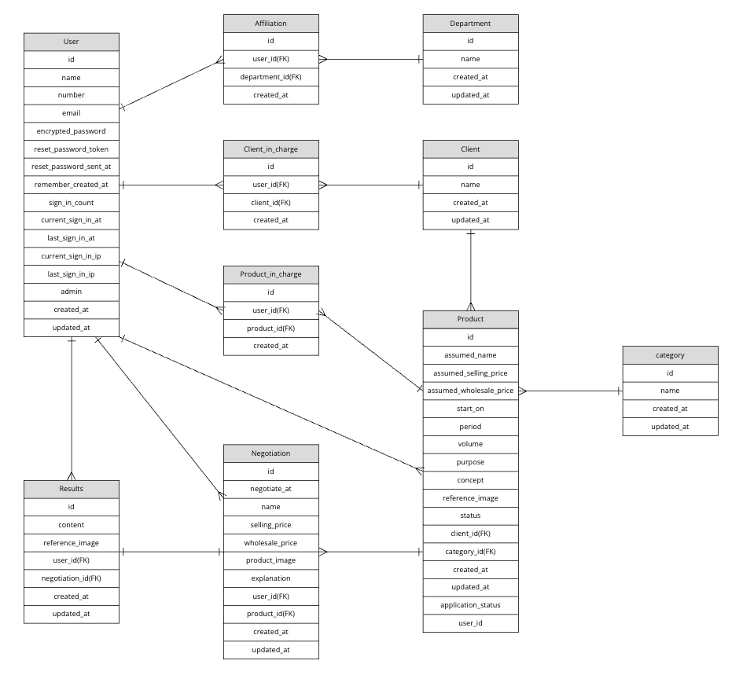

# README
## 開発言語
* ruby 3.0.1
* Rails 6.1.7.3
## 就職Termの技術
* gem devise
* AWS EC2
## カリキュラム外の技術
* gem rails_admin
* gem cancancan
* gem ransack
## 使用するgem
* gem rexml
## 実行手順
```
$ git clone git@github.com:MayuKishimoto/deli_reco.git
$ cd deli_reco
$ bundle install
$ yarn install
$ rails db:create && rails db:migrate
$ rails s
```
## カタログ設計
https://docs.google.com/spreadsheets/d/10X7MF5NUKX4eVua08ufPRxzaLpYxvSIitQ6jKfcLtbw/edit#gid=782464957
## テーブル定義書
https://docs.google.com/spreadsheets/d/10X7MF5NUKX4eVua08ufPRxzaLpYxvSIitQ6jKfcLtbw/edit#gid=2020033787
## ワイヤーフレーム
https://cacoo.com/diagrams/ZeBLZKWXgOwdYwCN/2471A
## ER図

## 画面遷移図
